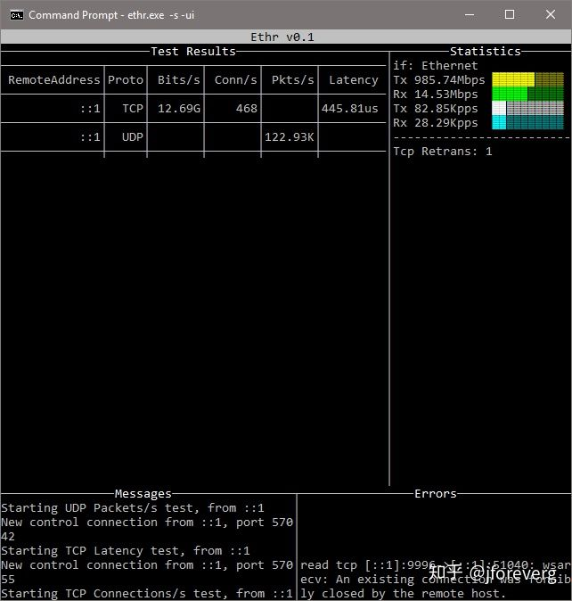

> https://github.com/Microsoft/Ethr

# 概念
1. Ethr 是基於 golang 的跨平台網路測量工具
2. 可測量頻寬用量、每秒連線數、每秒封包數、網路延遲、掉封包分析
3. 目前支援通訊協定 `TCP`, `UDP`, `HTTP`, `HTTPS`
4. 可在 windows, linux 或者其他 unix 系統
5. 使用
    - 將 Ethr 以 server 角色，架設在 cloud server 上
    - 建立另一台 cloud server, bandwidth, cpu , memory 均要較為優秀(或相同), 以 Ethr client 執行連線到 Ethr server

# Usage

```
Usage of ./ethr:
  -c string
    	Run as client and connect to server specified by String
  -d string
    	Duration for the test (format: <num>[s | m | h] 
    	0: Run forever (default "10s")
  -debug
    	Log debug output. Only valid if "-o" is specified.
  -i int
    	Number of round trip iterations for calculating latency. (default 1000)
  -l string
    	Length of buffer to use (format: <num>[KB | MB | GB])
    	Only valid for Bandwidth tests. Max 1GB. (default "16KB")
  -n int
    	Number of Threads
    	0: Equal to number of CPUs (default 1)
  -no
    	Disable logging output to file.
  -o string
    	Name of the file for logging output.
    	 (default "./ethrs.log for server, ./ethrc.log for client")
  -p string
    	Protocol ("tcp", "udp", "http", "https", or "icmp") (default "tcp")
  -s	Run as server
  -t string
    	Test to run ("b", "c", "p" or "l")
    	b: Bandwidth
    	c: Connections/s or Requests/s
    	p: Packets/s
    	l: Latency, Loss & Jitter (default "b")
  -ui
    	Show output in text UI. Valid for server only.
```


# Test

1. started the server with `ethr -s -ui` on latest archlinux, client is on win10
2. client
    - `ethr -c {ip} -t b -n 0`
    - `ethr -c {ip} -t c -n 0`
    - `ethr -c {ip} -t l -n 0`